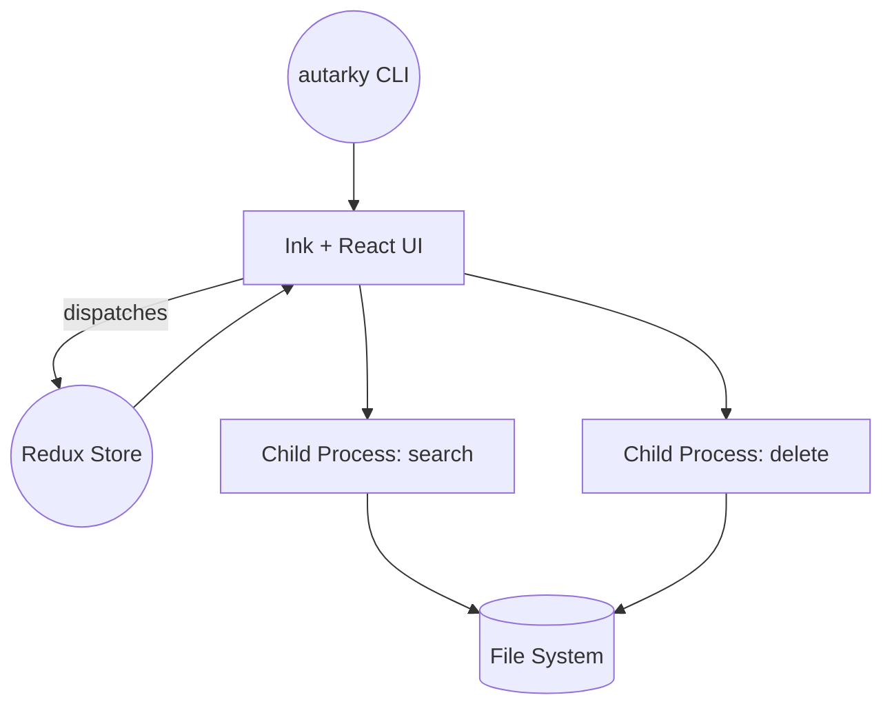

# Architecture

The CLI is written using React components rendered via [Ink](https://github.com/vadimdemedes/ink). Heavy file system operations run in child processes to keep the UI responsive. Redux tracks chosen directories and user confirmations.
